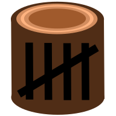

# CountLog

CountLog allows you to manually record, visualize, and analyze events to improve workflows in everyday life.

## Relevant Links

- Demo Site: <https://countlog.xyz>
- GitHub Repo: <https://github.com/craigcarr/CountLog>
- Documentation: <https://craigcarr.github.io/CountLog/>

## Features

- Create counters to and increment or decrement their values.
- Annotate increments and decrements with special contextual meaning.
- Visualize counter values over time for simple analysis.
- Query counters to gather useful historical metrics.
- Integrate counter modifications into other systems using HTTP.

## Installation

To install CountLog, simply visit <https://countlog.xyz>.

- On mobile, you must find an "Add to Home Screen" option in your browser's menu.
- On desktop (only works with Chrome), open the menu and click "Install CountLog".

## Contributing

See [CONTRIBUTING.md](CONTRIBUTING.md) for more details.

## License

CountLog is released under the MIT license. It is using `create-react-app`,
which can be found at <https://github.com/facebook/create-react-app>.
