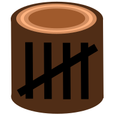

# Welcome to CountLog

CountLog allows you to manually record, visualize, and analyze events to improve workflows in everyday life.

## Relevant Links

- Demo/Install Site: <https://app.countlog.xyz>
- Documentation: <https://countlog.xyz/>
- GitHub Repo: <https://github.com/craigcarr/CountLog>

## Features

- Create counters to and increment or decrement their values.
- Annotate increments and decrements with special contextual meaning.
- Visualize counter values over time for simple analysis.
- Query counters to gather useful historical metrics.
- Integrate counter modifications into other systems using HTTP.
